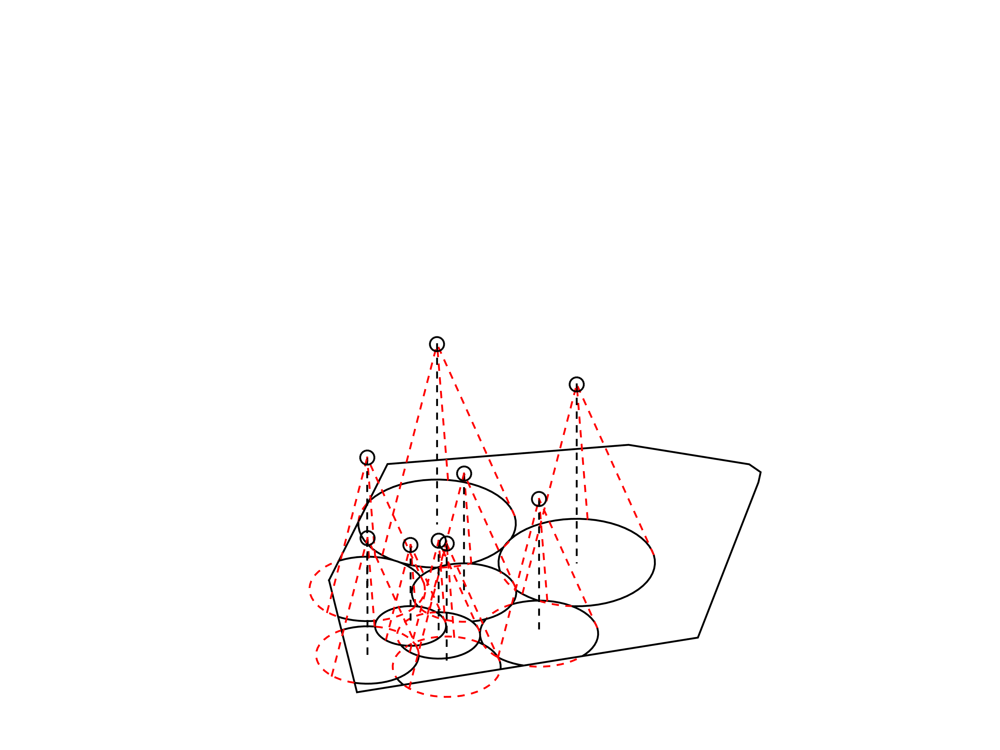
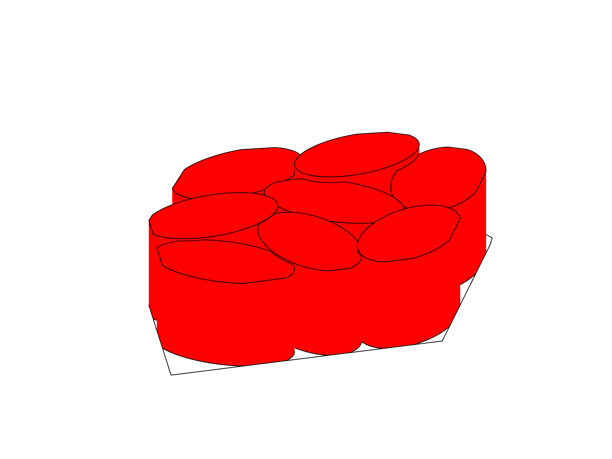

# UAV Coverage
Simulations for planar area coverage by a swarm of UAVs equipped with downwards facing cameras.

## Usage
Included are simulations taking into account different sensing patterns, coverage quality functions and region importance functions, each one being a different `.m` file. The initial network configuration and all simulation parameters are set inside these files which contain comments on their exact usage. The following simulations are included:
* `UAV_coverage_uniform_quality.m` simulates a network with circular sensing patterns and uniform coverage quality on a region whose points have equal importance.
* `UAV_coverage_decreasing_quality.m` simulates a network with with circular sensing patterns and decreasing coverage quality (paraboloid) on a region whose points have equal importance.
* `UAV_coverage_decreasing_quality_phi.m` simulates a network with circular sensing patterns and uniform coverage quality on a region whose points are assigned importance weights by a function phi.
* `UAV_coverage_anisotropic.m` simulates a network with with elliptical sensing patterns and uniform coverage quality on a region whose points have equal importance.

Included are also some `.m` files used for plotting the results of the aforementioned simulations, namely `FIGURE_simulation_results.m`, `FIGURE_simulation_comparison.m` and `FIGURE_simulation_results_anisotropic.m`.

Each simulation is structured as follows:
```c
Initialize region
Initialize network
Initialize simulation
while simulation is running {
    for each agent {
        Create sensed region
        Calculate coverage quality
    }
    for each agent {
        Calculate its assigned sensed region
    }
    Calculate the value of the optimization objective H
    Plot the network state
    for each agent {
        Calculate the control inputs
        Simulate movement with an ODE solver
    }
}
Save results to timestamped .mat file
```

## Screenshots
The following screenshots are from the `UAV_coverage_uniform_quality.m` simulation.

 
 


The following screenshots are from the `UAV_coverage_anisotropic.m` simulation.

 


## Relevant Publications
[1] S. Papatheodorou, A. Tzes, and Y. Stergiopoulos, [*Collaborative Visual Area Coverage*](https://doi.org/10.1016/j.robot.2017.03.005), Robotics and Autonomous Systems, ISSN 0921-8890, Volume 92, June 2017, Pages 126–138, Elsevier

[2] S. Papatheodorou and A. Tzes, *Cooperative Visual Convex Area Coverage using a Tessellation-free strategy*, In Proceedings of the 56th IEEE Conference on Decision and Control (CDC) 2017, December 12-15, 2017, Melbourne, Australia [Accepted]

## License
Distributed under the [Apache License Version 2.0](LICENSE.txt).
<br>
Copyright © 2016-2017 Sotiris Papatheodorou
