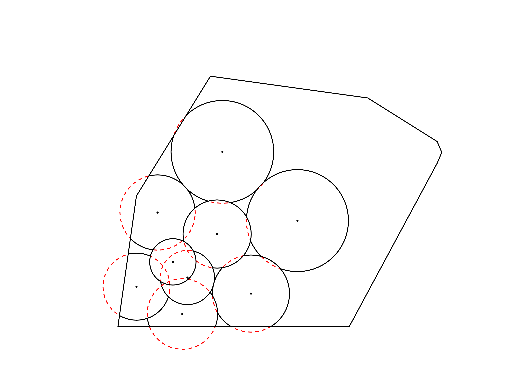

# UAV-Coverage
Simulation for planar area coverage by a swarm of UAVs equipped with downwrards facing cameras.

## Usage
The three simulations included are `UAV_coverage_uniform_quality.m`, `UAV_coverage_decreasing_quality.m` and `UAV_coverage_uniform_quality_phi.m`. `UAV_coverage_uniform_quality.m` simulates a network with uniform coverage quality on a region whose points have equal importance, `UAV_coverage_decreasing_quality.m` simulates a network with decreasing coverage quality (paraboloid) on a region whose points have equal importance and `UAV_coverage_decreasing_quality.m` simulates a network with uniform coverage quality on a region whose points are assigned importance weights by a function phi. The initial network configuration and all simulation parameters are set inside these files which contain comments on their exact usage.

The simulation structure is as follows:
* Initialize region, nodes and node parameters
* Create sensing regions and calculate coverage quality for each agent
* Partition the sensed space assigning a cell on each node based on its coverage quality
* Compute the value of the objective function H
* Calculate the control law input for each agent based on the sensed space partitioning
* Simulate the movement of ech agent with an ODE solver
* Plot the network state

Once the simulation is finished the results are saved in a timestamped `.mat` file.

## Screenshots
The following screenshots are from the `UAV_coverage_uniform_quality.m` simulation.
 
 

## License
Distributed under the [MIT License](LICENSE.txt).
 
Copyright © 2016 Sotiris Papatheodorou
