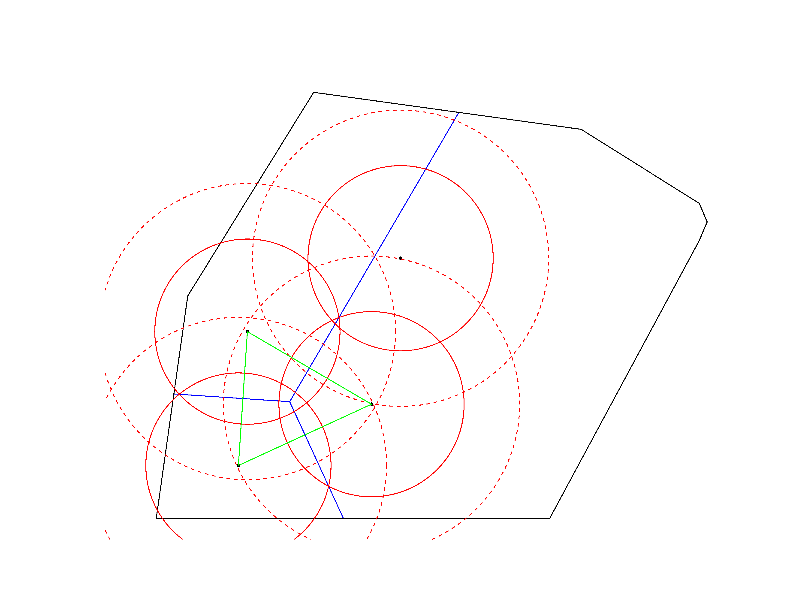
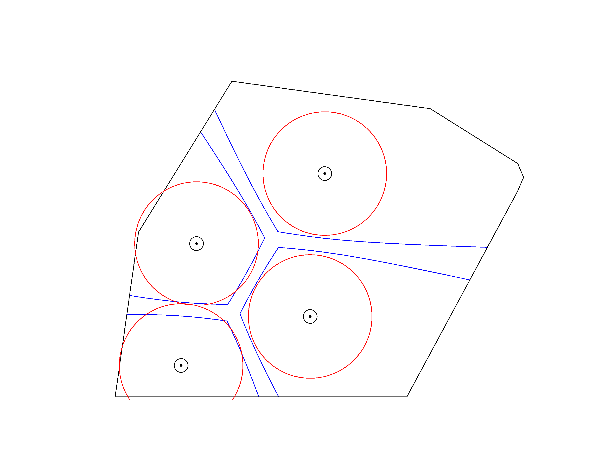
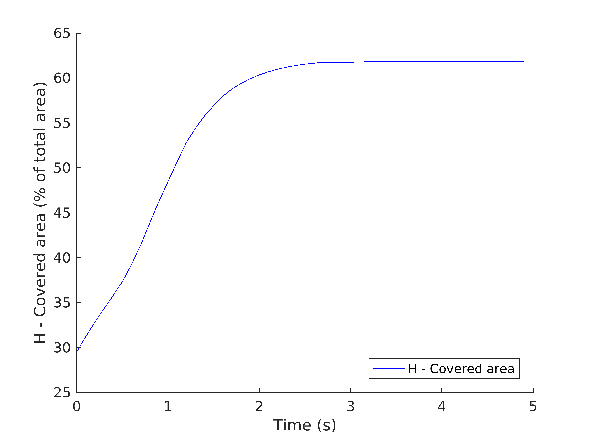
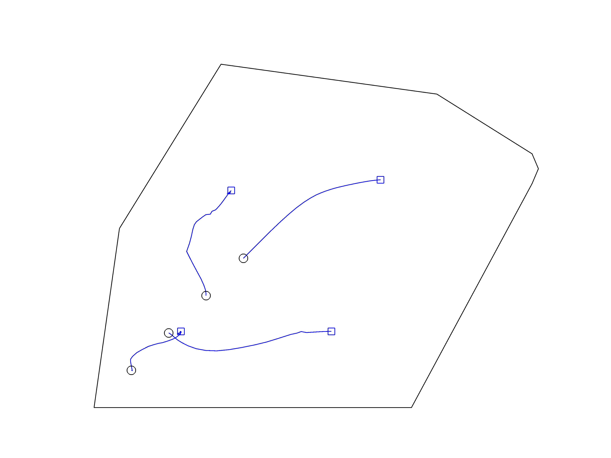

# UAV Coverage under positioning uncertainty
Simulation for planar area coverage of a convex region by a swarm of aerial robots. The aerial robots are assumed to remain at a constant altitude while the positioning uncertainty only affects their `x` and `y` coordinates.

The robot positioning can be exact, in which case a Voronoi partitioning is used, or uncertain in which case a Guaranteed Voronoi partitioning is used instead. The implemented control laws are:
- Cell centroid
- r-limited cell centroid
- Free arcs (optimal for Voronoi)
- GV complete (optimal for Guaranteed Voronoi)
- GV compromise (simpler suboptimal for Guaranteed Voronoi)

The robots are also allowed to have finite communication ranges, in which case they create their cells using only the nodes inside their communication radius. There are also options to restrict the movement of robots inside the region of interest and to prevent them from colliding when their positioning is uncertain.

### Usage
Before using the scripts, you must copy the the `gpcmex` file from `MATLAB/[Release]/toolbox/map/map/private/` into `Functions/Polygon`. The sample script `copy_gpcmex.sh` does this for a typical Linux installation of MATLAB R2016b.

`SIM_coverage_disks.m` Use this to run simulations. You can select the control law used by uncommenting the appropriate line at the beginning of the file. You can also set other simulation parameters there.

`PLOT_sim.m` Used to plot the data from a `.mat` file saved after the end of a simulation. Set the `.mat` file to load and the plots to show at the beginning of the file.

`PLOT_compare_sims.m` Used to compare the results of two simulations. Used the same way as `PLOT_sim.m`. Note that the simulations must have the same duration and time step.

### Screenshots
 
 

## References
[1] Sotiris Papatheodorou, Yiannis Stergiopoulos, Anthony Tzes, [*Distributed area coverage control with imprecise robot localization*](http://ieeexplore.ieee.org/document/7535920/), 24th Mediterranean Conference on Control and Automation (MED) 2016, pp. 214-219, 21-24 June 2016, Athens, Greece 

[2] Sotiris Papatheodorou, Anthony Tzes and K. Giannousakis, *Experimental Studies on Distributed Control for Area Coverage using Mobile Robots*, 25th Mediterranean Conference on Control and Automation (MED) 2017, 3-7 July 2017, Valetta, Malta [Accepted]

### License
Distributed under the [Apache License Version 2.0](LICENSE.txt)
 
Copyright © 2016-2017 Sotiris Papatheodorou
